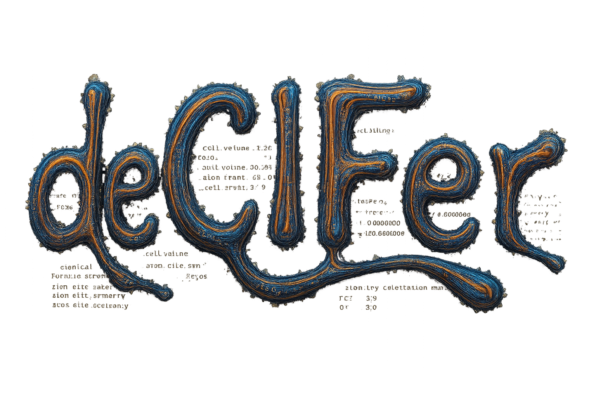

[](https://arxiv.org/abs/2502.02189) [](https://www.erda.dk/archives/b7342461e7c932bd99e8273c6a49e97b/published-archive.html)



# deCIFer: Crystal Structure Prediction from Powder Diffraction Data

**Downloads (model checkpoints, NOMA dataset, experimental data):**  
➡️ **[deCIFer Data Archive](https://www.erda.dk/archives/b7342461e7c932bd99e8273c6a49e97b/published-archive.html)**  
Download `decifer_v1_ckpt.pt` for the pretrained deCIFer checkpoint. See [Data Preparation](#data-preparation) for the NOMA dataset options.

## Table of Contents
1. [Setup](#setup)
2. [Data Preparation](#data-preparation)
3. [Training](#training)
4. [Evaluation Pipeline](#evaluation-pipeline)
5. [CIF Generation Consistency Experiment](#cif-generation-consistency-experiment)
6. [Troubleshooting](#troubleshooting)
7. [License](#license)

## Setup
deCIFer supports **Python 3.12 and 3.13**. Python 3.13 is used for the current test suite.

1. **Clone the repository**:
```bash
git clone https://github.com/FrederikLizakJohansen/deCIFer.git
cd deCIFer
```

2. **Create and activate an isolated environment.** To avoid conflicts with local installations, we strongly recommend installing into a fresh virtual environment, e.g. with Conda:
```bash
conda create -n decifer python=3.13
conda activate decifer
```
or with venv:
```bash
python3.13 -m venv .venv
source .venv/bin/activate
```

3. **Install deCIFer using setup.py**:
```bash
pip install -e .
```

4. **Ensure that you have PyTorch installed:**
Follow the instructions on the official PyTorch website to install the appropriate version for your system: PyTorch Installation Guide. (https://pytorch.org/get-started/locally/)

The editable install includes BraggCalculator and the other Python dependencies.

## Data Preparation

### Downloading the NOMA dataset

All files are available from the frozen archive:

➡️ **[deCIFer Data Archive](https://www.erda.dk/archives/b7342461e7c932bd99e8273c6a49e97b/published-archive.html)**

The NOMA dataset is assembled from [Materials Project](https://materialsproject.org/), [OQMD](https://oqmd.org/), and [NOMAD](https://nomad-lab.eu/). Two download options are available:

**Option A -- pre-serialized (recommended):**

Download `noma.zip` and extract it at the repo root. It should produce:

```
data/noma/
└── serialized/
    ├── train.h5
    ├── val.h5
    └── test.h5
```

No further preparation is needed. Skip to [Training](#training) or [Evaluation](#evaluation).

**Option B -- raw CIFs:**

Download `noma_cifs_raw.pkl.gz` and place it at `data/noma_cifs_raw.pkl.gz`. Then follow the preparation steps below. Run `prepare_dataset.py` with `--data-dir data/ --name noma` so the output lands at `data/noma/serialized/`.

### Preparing from raw CIFs

Before training or evaluation, the dataset must be preprocessed into a structured format that deCIFer can use. This includes **parsing CIF files**, **computing XRD patterns**, **tokenizing CIFs**, and **serializing the processed data into HDF5 format**.
To prepare a dataset, use the `prepare_dataset.py` script with the desired options. Here is an example:
```bash
python bin/prepare_dataset.py --data-dir data/ --name noma --all --raw-from-gzip
```
### Arguments:

- **General options**:
  - `--data-dir <path>`: Path to the directory containing raw CIF and PXRD data.
  - `--name <str>`: Identifier for the dataset (used to create an organized structure).
  - `--debug-max <int>`: Limits processing to the first `N` samples (useful for debugging).
  - `--raw-from-gzip`: Read the raw CIFs from a single gzipped pickle archive instead of individual `.cif` files. (This is the case for the NOMA dataset, depending on how the data is downloaded.) See [Expected input layout](#expected-input-layout) below.

### Expected input layout

`prepare_dataset.py` supports two input formats for the directory passed via `--data-dir`:

- **Without `--raw-from-gzip`** (default): individual CIF files are expected in a `raw/` subdirectory:
```bash
data/noma/
├── raw/
│   ├── structure_0001.cif
│   ├── structure_0002.cif
│   └── ...
```
- **With `--raw-from-gzip`**: exactly **one** `*.pkl.gz` archive (a gzipped pickle containing the collection of raw CIFs) is expected directly in the data directory:
```bash
data/noma/
├── noma.pkl.gz
```
If more than one `*.pkl.gz` file is present in the directory, the script stops with `AssertionError: from_gzip flag is raised, but more than one gzip file found in directory`. In that case, keep only the archive you want to process in the directory (or move the others elsewhere), or extract the CIFs into `raw/` and run without `--raw-from-gzip`.

- **Processing steps**:
  - `--preprocess`: Parses and cleans CIF files.
  - `--xrd`: Computes diffraction patterns.
  - `--tokenize`: Tokenizes CIF files for transformer-based models.
  - `--serialize`: Serializes the processed dataset into HDF5 format.
  - `--all`: Runs **all** preprocessing steps in sequence.

- **Processing options**:
  - `--num-workers <int>`: Number of parallel processes to use (default: all available CPUs - 1).
  - `--include-occupancy-structures`: Include structures with atomic site occupancies below 1. (False for deCIFer and U-deCIFer)
  - `--ignore-data-split`: Disable automatic train/val/test splitting and serialize all data into `test.h5`.

### Output Directory Structure

After running `prepare_dataset.py`, the processed data will be stored in the following structure:
```bash
data/noma-1k/
├── preprocessed/ – Parsed CIF files (cleaned, formatted, tokenized)
├── xrd/ – Computed XRD patterns
├── cif_tokens/ – Tokenized CIF representations
├── serialized/ – Final dataset (train/val/test) stored as HDF5 files
├── metadata.json – Stores some metadata
```

### Minicif v2 workflow

`minicif_v2` is the symmetry-aware experimental representation. It stores an
integral reduced formula and one representative site per Wyckoff orbit:

```text
<mcif2> Na Cl formula Na 1 Cl 1 cs_7 sg_225 cell ... <atom> Na wp_a x y z occ ... </mcif2>
```

The converter refines each structure to a conventional symmetry setting before
writing the target. Structure reconstruction expands the declared Wyckoff sites
with the emitted space group and validates the resulting composition and
Wyckoff letters. The default preparation path excludes partial occupancies.

Prepare v2 data from the NOMA gzip bundle:

```bash
python bin/prepare_minicif_dataset.py \
  --raw-dir data/noma \
  --out-dir data/noma_minicif_v2 \
  --raw-from-gzip \
  --representation minicif_v2 \
  --xrd-backend braggcalculator
```

`--xrd-backend auto` is the default: it uses the installed BraggCalculator and
falls back to pymatgen if it is unavailable. The resolved backend is stored in
checkpoints and serialized splits, and mixed-backend resume/merge operations are
rejected. BraggCalculator 0.3.0 or newer is required for the batched artifact
pipeline.

Preparation defaults to `--max-token-length 769`. Longer structural targets are
rejected before diffraction calculation, so extreme structures do not consume
Bragg generation time or enter the standard prepared dataset. Smaller models
apply their stricter context limit when loading the shared dataset. Use
`--max-token-length 0` only when intentionally preparing data for a larger
context model. Training still applies its own config-specific length filter.

Audit the prepared splits before allocating a GPU. This checks sequence-length
compatibility against the selected config, representation metadata, token/string
round trips, formula and symmetry metadata, sampled Wyckoff expansion, and PXRD
array integrity. It exits nonzero on any failure.

```bash
python bin/audit_minicif_v2.py \
  --config configs/config_v2/peak/standard/small.yaml \
  --max-items 100 \
  --output minicif_v2_preflight.json
```

Valid structures can still be too long for a particular model context. The
audit reports these as `n_overlength_records`, and record-mode training excludes
them for that config while preserving them in the HDF5 dataset for larger
models. Exclusion counts are printed at startup and stored in
`run_metadata.yaml`.

Prepared HDF5 files contain clean sparse peak lists. BraggCalculator applies
calibration, intensity, profile, background, spurious-peak, noise, and detector
artifacts in batches during training. A new artifact realization is sampled for
each batch, so artifacts do not increase dataset size and the clean dataset does
not need to be regenerated when the artifact model changes. Validation remains
clean and deterministic.

Run the full-artifact pipeline check and recommended hybrid model:

```bash
python bin/train.py --config configs/config_v2/smoke/hybrid.yaml
python bin/train.py --config configs/config_v2/hybrid/standard/medium.yaml
```

The smoke config runs only two optimizer steps and is not a scientific baseline.
The complete v2 matrix lives under `configs/config_v2`. It provides small,
medium, and large peak, dense, and hybrid models with standard and
encoder-heavy parameter allocations.
Full profile artifacts require a `dense` or `hybrid` condition encoder because
background and detector effects cannot be represented by a sparse peak list.
The training artifact YAML must not set a fixed seed.

At inference, the formula is optional input. `pxrd-elements` supplies only the
known constituent set and lets the model infer stoichiometry; `pxrd-stoichiometry`
also supplies the reduced formula. The generated v2 target always contains a
formula so composition can be validated deterministically.

```bash
python bin/visualize_minicif.py \
  --checkpoint models/minicif_v2/hybrid/standard/medium/ckpt.pt \
  --dataset-dir data/noma_minicif_v2 \
  --artifact-config configs/xrd_artifacts/full_evaluation.yaml \
  --prompt-modes pxrd pxrd-elements pxrd-stoichiometry \
                 pxrd-stoichiometry-cs pxrd-stoichiometry-cs-sg
```

The evaluation artifact profile has a fixed seed. Each source record receives a
repeatable, distinct artifact realization. Omit `--artifact-config` for clean
evaluation. Reports include linear-scale learning curves, overall and
per-crystal-system metrics, best-Rwp distributions and CDFs, Rwp-versus-RMSD,
and default PXRD-plus-structure examples covering the available crystal systems.

Add BraggCalculator 0.4.1 refinement for every valid generated candidate:

```bash
python bin/visualize_minicif.py \
  --checkpoint models/minicif_v2/peak/standard/medium/ckpt.pt \
  --dataset-dir data/noma_minicif_v2 \
  --refinement-config configs/refinement/quick.yaml
```

The existing CSV outputs gain refined structural and fit metrics. The evaluator
also writes the complete refinement results to
`minicif_refinement_results.jsonl.gz`, including profiles, residuals,
parameters, histories, warnings, convergence data, and refined CIFs. Figures
compare Rwp before and after refinement globally and for each reference crystal
system. Candidate-specific refinement failures are recorded without stopping
the run. Configuration and CLI options are listed in
[`configs/refinement/README.md`](configs/refinement/README.md).

Evaluation is resumable at each sample and prompt mode. Split checkpoints are
stored in `OUT_DIR/evaluation_checkpoints/`, and rerunning the same command
continues from the last committed unit. Run `train`, `val`, and `test` in
separate commands with the same output directory to build a staged report.
Every run combines all available split checkpoints and writes individual tables
under `OUT_DIR/split_metrics/`. Reports can also be rebuilt without inference:

```bash
python bin/visualize_minicif.py \
  --combine-only \
  --out-dir models/minicif_v2/peak/standard/medium/minicif_report
```

Use `--restart-splits --splits SPLIT` to discard and recompute selected split
checkpoints.

Successful refinement results can be included when plotting examples from an
existing report:

```bash
python bin/plot_minicif_examples.py \
  --report-dir models/minicif_v2/peak/standard/medium/minicif_report \
  --show-refined
```

The resulting figures show reference, generated, and refined PXRD profiles and
structures. Evaluation presets for quick, cautious, robust, coordinate, and
species-assignment experiments are described in
[`configs/refinement/README.md`](configs/refinement/README.md).

The v2 configs use record-aligned, length-bucketed token-budget batches, sparse
Fourier or hybrid PXRD conditioning, cross-attention, typed vocabulary heads,
constrained lattice generation, fused AdamW on CUDA, and cached
self/cross-attention during generation. Preferred-orientation artifacts are not
enabled yet: a physically meaningful transform requires unmerged HKL and lattice
metadata, which the current sparse HDF5 schema does not store. Existing
`minicif` and legacy deCIFer datasets/checkpoints remain separate and compatible
with their original paths.

## Training
### Training From Scratch

To train deCIFer from scratch, you need to specify the training configuration and dataset. The model will initialize randomly and train from the beginning.

#### Required Arguments:
- `--config <path>`: Path to a YAML configuration file specifying training parameters.

#### Example Usage:
```bash
python bin/train.py --config config/train.yaml
```
This initializes a new model and starts training using the settings specified in `train.yaml`.

### Resuming Training

If training was previously interrupted or stopped, you can resume from a saved checkpoint. This allows training to continue from where it left off.
#### Required Arguments:
- `--config <path>`: Path to the same YAML configuration file used during training.
- Ensure that the `init_from` option in the YAML file is set to `"resume"`.

### Configuration File (`train.yaml`)

The training parameters are stored in a YAML file. Below is an example configuration:

```yaml
out_dir: "models/deCIFer"  # Directory where checkpoints and logs will be saved
dataset: "data/noma/1k/serialized/"  # Path to the dataset
init_from: "scratch"  # Options: 'scratch' (new training), 'resume' (continue training)

# Model parameters
n_layer: 8
n_head: 8
n_embd: 512
dropout: 0.0
boundary_masking: True
condition: True

# Training parameters
batch_size: 64
gradient_accumulation_steps: 40
max_iters: 50000
learning_rate: 6e-4
weight_decay: 0.1
warmup_iters: 2000
early_stopping_patience: 50

# Evaluation settings
eval_interval: 250
eval_iters_train: 200
eval_iters_val: 200
validate: True
```
Modify this file as needed to adjust the training settings.

### Output Structure
After training starts, the model and logs will be saved in the output directory:
```bash
models/deCIFer/
├── ckpt.pt – Latest model checkpoint including model dictionary, loss metrics, etc.
```
### Monitoring Training
During training, logs will be printed to the console, showing:
- Loss values
- Evaluation results on the validation set
- Learning rate adjustments
- Checkpoint saving status
  
Example output:
```bash
iter 1000: loss 0.4123, time 58.2ms
step 1000: train loss 0.4123, val loss 0.4289
saving checkpoint to models/deCIFer/...
```

### Early Stopping
If validation loss does not improve for a set number of evaluations (early_stopping_patience), training will stop automatically.

#### Example Usage:
```bash
python bin/train.py --config config/train.yaml
```
The script will automatically load the latest checkpoint from the output directory specified in the configuration file and continue training.

## Evaluation Pipeline
The evaluation process consists of two main steps: **generating evaluations** for model predictions and **collecting** them into a single file for visualization and analysis.

### Step 1: Generate Evaluations

This step evaluates the model on a test dataset and saves individual `.pkl.gz` evaluation files. These separate files allow evaluations to be merged across different datasets and enable checkpointing (resuming evaluation later if needed).

#### Required Arguments:
- `--model-ckpt <path>`: Path to the trained model checkpoint.
- `--dataset-path <path>`: Path to the test dataset in HDF5 format.
- `--dataset-name <str>`: Identifier for the dataset.
- `--out-folder <path>`: Folder where evaluation files will be stored.

#### Optional Arguments:
- `--num-workers <int>`: Number of worker processes for parallel evaluation.
- `--debug-max <int>`: Maximum number of samples to process (for debugging).
- `--add-composition`: Include atomic composition information in the evaluation.
- `--add-spacegroup`: Include space group information in the evaluation.
- `--max-new-tokens <int>`: Maximum number of tokens to generate for CIF structures.
- `--num-reps <int>`: Number of times to generate a CIF for each test sample.
- `--override`: Force regeneration of evaluations even if files already exist.
- `--temperature <float>`: Sampling temperature for CIF generation.
- `--top-k <int>`: Top-k filtering during sampling.
- `--condition`: Use XRD conditioning for generation.

#### Example Usage:

Run evaluation on a test dataset and save results:

```bash
python bin/evaluate.py \
  --model-ckpt deCIFer_model/ckpt.pt \
  --dataset-path data/noma/1k/serialized/test.h5 \
  --dataset-name noma-1k \
  --out-folder eval_files \
  --add-composition \
  --add-spacegroup
```
Each evaluated structure will be saved as an individual .pkl.gz file in eval_files/eval_files/noma-1k/.

### Step 2: Collect Evaluations

Once all evaluations are generated, they need to be aggregated into a single `.pkl.gz` file. This file is used for computing metrics and visualizing results.

#### Required Arguments:
- `--eval-folder-path <path>`: Path to the directory containing the individual evaluation files.
- `--output-file <path>`: Name of the final collected evaluation file.

#### Example Usage:
```bash
python bin/collect_evaluations.py --eval-folder-path eval_files/eval_files/noma-1k --output-file eval_files/noma-1k_collected.pkl.gz
```
This collects all individual `.pkl.gz` evaluation files and stores the merged results in `noma-1k_collected.pkl.gz`.

### Output Structure

After running the evaluation pipeline, the output structure will be:
```bash
eval_files/  
├── eval_files/noma-1k/ – Individual evaluation files (`.pkl.gz` per sample)  
├── noma-1k_collected.pkl.gz – Merged evaluation results
```

#### Evaluation Details

Each evaluation file contains:
- **Generated CIF file**
- **PXRD-based metrics**
- **Validity checks**:
  - Formula consistency
  - Bond length reasonableness
  - Space group consistency
  - Unit cell parameters
- **Root Mean Square Deviation (RMSD)** from reference structure

## CIF Generation Consistency Experiment

The **CIF Generation Consistency Experiment** evaluates the reproducibility of generated crystal structures across multiple repetitions. The script takes a dataset of CIFs, generates multiple versions of each, and compares their structural and diffraction consistency.

### Running the Consistency Experiment

To perform the experiment, use the following command:
```bash
python bin/generation_consistency.py --num_cifs 100 --num_reps 5 --batch_size 16 --qmin 0.0 --qmax 10.0 --qstep 0.01 --fwhm 0.05 --output_folder results/consistency_experiment --model_path deCIFer_model/ckpt.pt --dataset_path data/noma/1k/serialized/test.h5 --add_comp --add_spg
```

#### Required Arguments:
- `--num_cifs <int>`: Number of CIFs to process.
- `--num_reps <int>`: Number of times to generate each CIF.
- `--output_folder <path>`: Directory where results will be saved.
- `--model_path <path>`: Path to the pretrained model checkpoint.
- `--dataset_path <path>`: Path to the dataset in HDF5 format.

#### Optional Arguments:
- `--batch_size <int>`: Number of CIFs to generate in parallel (default: 16).
- `--qmin <float>`: Minimum Q value for XRD computation (default: 0.0).
- `--qmax <float>`: Maximum Q value for XRD computation (default: 10.0).
- `--qstep <float>`: Step size for Q values (default: 0.01).
- `--fwhm <float>`: Full-width at half-maximum for XRD broadening (default: 0.05).
- `--noise <float>`: Optional noise level in XRD computation.
- `--add_comp`: Include atomic composition in the conditioning prompt.
- `--add_spg`: Include space group information in the conditioning prompt.

### Output Structure

After running the experiment, the results will be stored in the following structure:
```bash
results/consistency_experiment/
├── CIF_NAME_1/ – Folder containing generated CIFs for the first structure  
│   ├── CIF_NAME_1_0.cif – First repetition  
│   ├── CIF_NAME_1_1.cif – Second repetition  
│   ├── ...  
├── CIF_NAME_2/ – Folder containing generated CIFs for the second structure  
│   ├── CIF_NAME_2_0.cif  
│   ├── CIF_NAME_2_1.cif 
│   ├── ...  
├── results.pkl – A pickled summary of all results
```

### Evaluation Metrics

Each generated CIF is analyzed for structural and diffraction consistency. The following metrics are computed:

- **Residual Weighted Profile (Rwp)**: Measures the difference between the experimental and generated XRD patterns.
- **Root Mean Square Deviation (RMSD)**: Measures the structural deviation between generated and reference CIFs.
- **Crystal System Consistency**: Checks if the generated structure belongs to the same crystal system as the reference.
- **Space Group Consistency**: Compares the space group number of the generated structure with the original.
- **Lattice Parameter Deviations**:
  - `a`, `b`, `c`: Unit cell lengths.
  - `α`, `β`, `γ`: Unit cell angles.

## Follow-up Paper: Tackling Real-World Crystal Structure Prediction from Powder X-ray Diffraction Data

Scripts, configs, and notebooks for the follow-up paper are in [`follow-up-paper-Tackling-Real-World-CSP/`](follow-up-paper-Tackling-Real-World-CSP/). See the [README there](follow-up-paper-Tackling-Real-World-CSP/README.md) for full instructions on reproducing paper figures, running experiments, and training from scratch.

## Troubleshooting

- **`AssertionError: from_gzip flag is raised, but more than one gzip file found in directory`** — `--raw-from-gzip` expects exactly one `*.pkl.gz` archive in the directory passed via `--data-dir`. Remove or relocate any additional `.pkl.gz` files, or extract the CIFs into a `raw/` subdirectory and run without `--raw-from-gzip`. See [Expected input layout](#expected-input-layout).
- **`Cannot locate any files in <dir>`** — without `--raw-from-gzip`, the script looks for `*.cif` files inside a `raw/` subdirectory of `--data-dir`, not in the directory itself.
- **`ModuleNotFoundError` / import errors** — make sure the Python 3.12 or 3.13 environment is activated and that `pip install -e .` (step 3) was run in that same environment.
- **PyTorch / CUDA errors** — install the PyTorch build matching your CUDA version from the [official selector](https://pytorch.org/get-started/locally/). The CPU-only build works for inference with the pretrained checkpoint, but training is impractical without a GPU.
- **Out-of-memory during generation** — reduce `--batch_size` (or `batch_size` in the YAML config) and/or `--max-new-tokens`.

## License
deCIFer is released under the **MIT License**.
